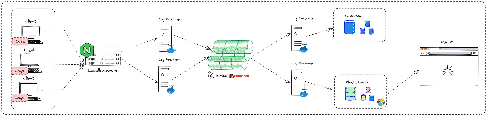

# Dyte Assignment

Log Ingestor and Query Interface

  

## Contents
1. [Introduction](#-introduction)
3. [Problem Statement](#-problem-statement)
. [Requirements](#-requirements)
4. [Features Implemented](#-features-implemented)
5. [Demo Video](#-demo-video)
7. [Solution Architecture](#-solution-architecture)
8. [Technologies Used](#-technologies-used)
9. [Why this Architecture](#-why-this-architecture-stands-out-best)
10. [Benchmarking](#-benchmarking)
13. [How it Can be Improved Further](#-how-it-can-be-improved-further)
15. [Commit Histories](#-commit-histories)
16. [References Used](#-references-used)
17. [Note of Thanks](#-note-of-thanks)

## 🌐 Introduction

- Name: Niku Singh
- Email: nikusingh319@gmail.com, soapmactavishmw4@gmail.com
- Github Username: NIKU-SINGH
- LinkedIn: https://www.linkedin.com/in/niku-singh/
- Twitter: https://twitter.com/Niku_Singh_
- University: Dr B R Ambedkar National Institute of Technology, Jalandhar

## 🤔 Problem Statement

Develop a log ingestor system that can efficiently handle vast volumes of log data, and offer a simple interface for querying this data using full-text search or specific field filters.

Both the systems (the log ingestor and the query interface) can be built using any programming language of your choice.

The logs should be ingested (in the log ingestor) over HTTP, on port `3000`.

# 📝 Requirements

### Log Ingestor:

- Develop a mechanism to ingest logs in the provided format.
- Ensure scalability to handle high volumes of logs efficiently.
- Mitigate potential bottlenecks such as I/O operations, database write speeds, etc.
- Make sure that the logs are ingested via an HTTP server, which runs on port `3000` by default.

### Query Interface:

- Offer a user interface (Web UI or CLI) for full-text search across logs.
- Include filters based on:
  - level
  - message
  - resourceId
  - timestamp
  - traceId
  - spanId
  - commit
  - metadata.parentResourceId
- Aim for efficient and quick search results.

## ⚙️ Features Implemented

- [x] Log Ingestor
- [x] Ability to send http response
- [x] Added Kafka, Logstash , elasticsearch
- [x] Highly scalable and fault tolerant
- [x] 
- [] Query Interface

## 📹 Demo Video

# 💡 Solution Proposed

## 🏛️ Proposed Architecture

- After spending a considerable amount of time in the researh I found the above arhitecture to be suitable for handling more than 1 Million + users.

## 💻 Technologies Used

### Frontend

| Technology Used                                  | Reason             |
| ------------------------------------------------ | ------------------ |
| [ReactJS](https://reactjs.org/)                  | UI Development     |
| [Vite](https://vitejs.dev/)                      | Fast Development   |
| [Tailwind CSS](https://tailwindcss.com/)         | Styling Efficiency |
| [Axios](https://axios-http.com/)                 | HTTP Requests      |

### Backend
| Technology Used                        | Reason                                                   |
| -------------------------------------- | -------------------------------------------------------- |
| [Node.js](https://nodejs.org/)         | Server-Side JavaScript and Backend Development           |
| [Express](https://expressjs.com/)      | Minimalist Web Application Framework for Node.js         |
| [PostgreSQL](https://www.postgresql.org/) | Robust Relational Database Management System            |
| [Elasticsearch](https://www.elastic.co/elasticsearch/) | Distributed Search and Analytics Engine          |
| [Logstash](https://www.elastic.co/logstash/) | Data Processing and Ingestion Tool for Elasticsearch |
| [Pino](https://github.com/pinojs/pino) | Fast and Low Overhead Node.js Logger                     |
| [Apache Kafka](https://kafka.apache.org/) | Distributed Streaming Platform for Real-Time Data       |
| [Docker](https://www.docker.com/)      | Container Orchestration                                  |
| [NGINX](https://www.nginx.com/)        | Load Balancer and Web Server                             |
| [Redpanda](https://vectorized.io/redpanda) | Modern Streaming Platform Built on Kafka                |

<!-- ### Backend
 -->

## 🏆 Why this Architecure 

## 📊 Benchmarking

For testing a Node.js application to assess its performance and scalability some of the tools that I can use are

1. Artillery
2. K6

<!-- ## ⚠️ Possible Bottlenecks -->

## 🔄 How it can be Improved Further

<!-- ## 📝 Commit Histories -->

## 📖 References Used

<!-- ## 🙏 Note of Thanks -->

