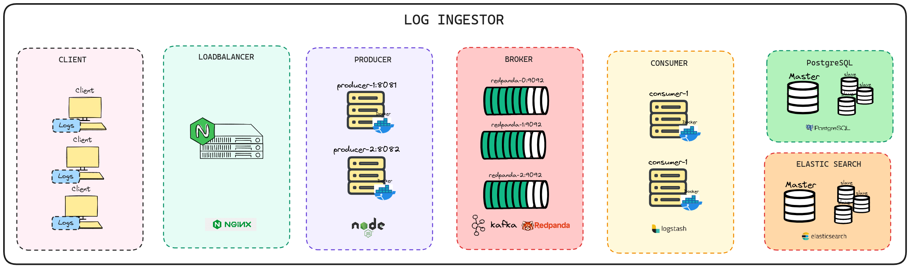
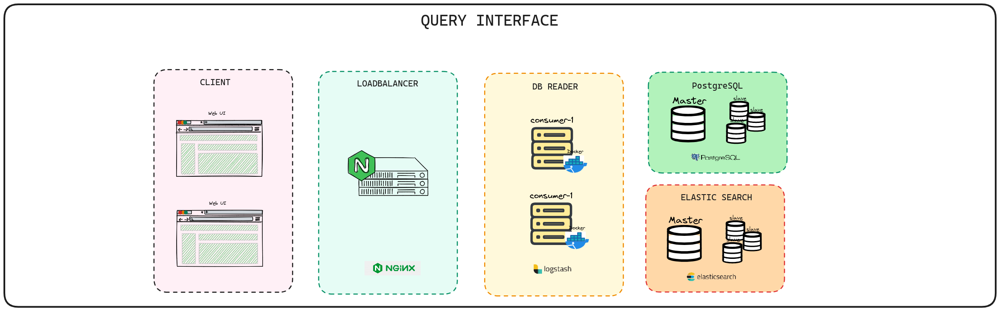

## IngestFlow


- Scalable & Fault-Tolerant Log Ingestion with IngestFlow: Harness Redpanda's Speed and Elasticsearch's Robust Search for Effortless Log Management

## Contents
1. [Introduction](#-introduction)
2. [Problem Statement](#-problem-statement)
3. [Requirements](#-requirements)
4. [Features Implemented](#-features-implemented)
5. [Demo Video](#-demo-video)
7. [Solution Architecture](#-solution-architecture)
8. [Technologies Used](#-technologies-used)
9. [Why this Architecture](#-why-this-architecture-stands-out-best)
10. [Benchmarking](#-benchmarking)
13. [How it Can be Improved Further](#-how-it-can-be-improved-further)
15. [Commit Histories](#-commit-histories)
16. [References Used](#-references-used)
17. [Note of Thanks](#-note-of-thanks)

## 🌐 Introduction

- Name: Niku Singh
- Email: nikusingh319@gmail.com, soapmactavishmw4@gmail.com
- Github Username: NIKU-SINGH
- LinkedIn: https://www.linkedin.com/in/niku-singh/
- Twitter: https://twitter.com/Niku_Singh_
- University: Dr B R Ambedkar National Institute of Technology, Jalandhar

## 🤔 Problem Statement

Develop a log ingestor system that can efficiently handle vast volumes of log data, and offer a simple interface for querying this data using full-text search or specific field filters.

Both the systems (the log ingestor and the query interface) can be built using any programming language of your choice.

The logs should be ingested (in the log ingestor) over HTTP, on port `3000`.

# 📝 Requirements

### Log Ingestor:

- Develop a mechanism to ingest logs in the provided format.
- Ensure scalability to handle high volumes of logs efficiently.
- Mitigate potential bottlenecks such as I/O operations, database write speeds, etc.
- Make sure that the logs are ingested via an HTTP server, which runs on port `3000` by default.

### Query Interface:

- Offer a user interface (Web UI or CLI) for full-text search across logs.
- Include filters based on:
  - level
  - message
  - resourceId
  - timestamp
  - traceId
  - spanId
  - commit
  - metadata.parentResourceId
- Aim for efficient and quick search results.

## ⚙️ Features Implemented

- [x] Log Ingestor
- [x] Ability to send http response
- [x] Loadbalancing 
- [x] Redpanda and Kafka support
- [x] Logstash integration
- [x] Elasticsearch support
- [x] PostgreSQL support
- [x] Query Interface

## 📹 Demo Video

https://www.loom.com/share/cd05ff3e9dbe4963afdff4dc5de35f0a
IngestFlow : Log Ingestor and Query Tool - Watch Video


# 💡 Solution Proposed

## 🏛️ Proposed Architecture





## 💻 Technologies Used

### Frontend

| Technology Used                                  | Reason             |
| ------------------------------------------------ | ------------------ |
| [ReactJS](https://reactjs.org/)                  | UI Development     |
| [Vite](https://vitejs.dev/)                      | Fast Development   |
| [Tailwind CSS](https://tailwindcss.com/)         | Styling Efficiency |
| [Axios](https://axios-http.com/)                 | HTTP Requests      |

### Backend
| Technology Used                        | Reason                                                   |
| -------------------------------------- | -------------------------------------------------------- |
| [Node.js](https://nodejs.org/)         | Server-Side JavaScript and Backend Development           |
| [Express](https://expressjs.com/)      | Minimalist Web Application Framework for Node.js         |
| [PostgreSQL](https://www.postgresql.org/) | Robust Relational Database Management System            |
| [Elasticsearch](https://www.elastic.co/elasticsearch/) | Distributed Search and Analytics Engine          |
| [Logstash](https://www.elastic.co/logstash/) | Data Processing and Ingestion Tool for Elasticsearch |
| [Pino](https://github.com/pinojs/pino) | Fast and Low Overhead Node.js Logger                     |
| [Apache Kafka](https://kafka.apache.org/) | Distributed Streaming Platform for Real-Time Data       |
| [Docker](https://www.docker.com/)      | Container Orchestration                                  |
| [NGINX](https://www.nginx.com/)        | Load Balancer and Web Server                             |
| [Redpanda](https://vectorized.io/redpanda) | Modern Streaming Platform Built on Kafka                |


<!-- ### Backend
[](https://skillicons.dev) -->

## 🏆 Why this Architecure 


## 📊 Benchmarking

For testing a Node.js application to assess its performance and scalability some of the tools that I can use are

1. Artillery
2. K6

<!-- ## ⚠️ Possible Bottlenecks -->


## 🔄 How it can be Improved Further

## ⚒️ Usage

### Forking the Repository

To get started with this project, fork the repository by clicking on the "Fork" button in the upper right corner of the page.

### Local Installation

1. Clone the forked repository to your local machine.

    ```bash
    git clone https://github.com/dyte-submissions/november-2023-hiring-NIKU-SINGH.git
    ```

2. Navigate to the project directory.

    ```bash
    cd november-2023-hiring-NIKU-SINGH
    ```

3. Install dependencies.

    ```bash
    npm install
    ```

### Docker Installation

1. Ensure Docker is installed on your system. If not, download and install it from [Docker's official website](https://www.docker.com/get-started).

2. Run the Docker Container

    ```bash
    docker compose up --build
    ```


### Sending Requests with cURL

Once the project is running either locally or using Docker, you can interact with the endpoint using cURL commands.

#### Example: Sending a GET request to the endpoint to check health status

```bash
curl -X POST -H "Content-Type: application/json" -d '{"name": "Niku", "message": "Your app is lovely please Star and Fork it"}' http://localhost:3000
```


<!-- ## 📝 Commit Histories -->

## 📖 References Used


## 🙏 Note of Thanks


